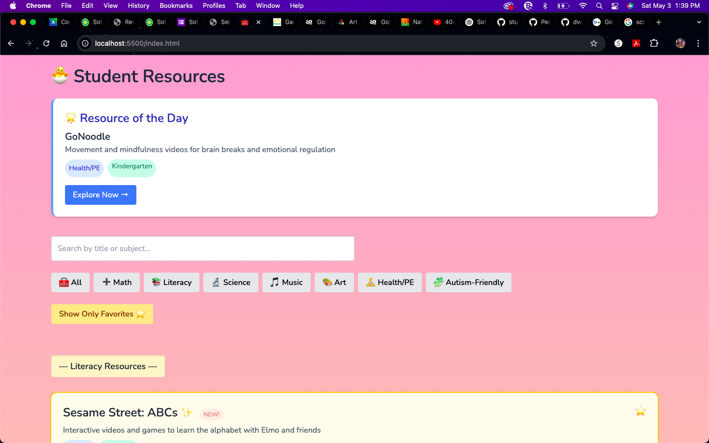
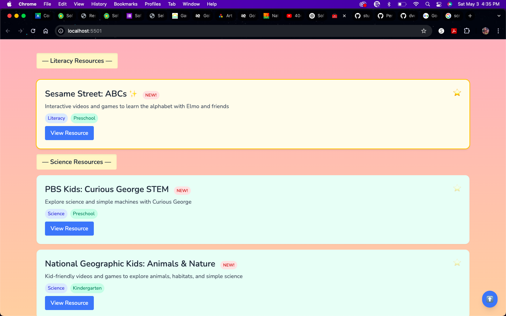
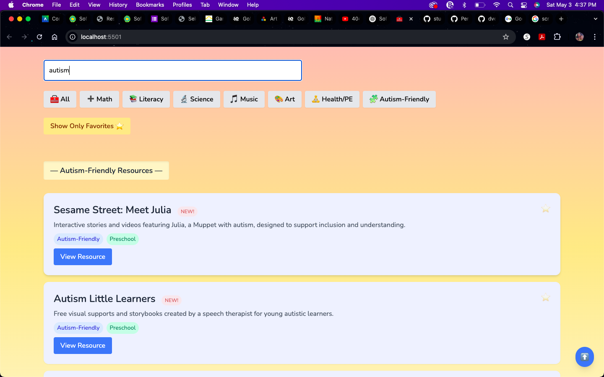

# 🧰 Student Support Portal

The **Student Support Portal** is a beautifully styled, responsive web application that helps parents and educators discover engaging, age-appropriate, and autism-friendly educational resources. Built with a Django REST API and a lightweight JavaScript frontend, it features dynamic filtering, local favorites, and smooth animations for a user-friendly experience.

---

## 💡 Features

- 🎯 **Filter by Subject** — Find resources for Math, Literacy, Science, Art, and more  
- 🔍 **Live Search** — Instantly filter resources by keyword or subject  
- ⭐ **Favorites** — Save favorite resources in your browser (localStorage)  
- 🧩 **Autism-Friendly Content** — Dedicated filters for sensory-friendly, visual learning tools  
- 🎨 **Polished UI** — Custom design with TailwindCSS and subtle animations  
- 📱 **Responsive Layout** — Works well on desktop and mobile  
- ⬆️ **Scroll-to-Top Button** — Appears when you scroll for easier navigation  
- ✨ **Fun Interactions** — Hover, pulse, and twinkle effects for buttons and cards  

---

## 🛠 Tech Stack

**Frontend**
- HTML / CSS (via TailwindCSS)  
- JavaScript (Vanilla)  
- LocalStorage for favorites  

**Backend**
- Python  
- Django  
- Django REST Framework  

---

## 🚀 Getting Started

### 1. Clone the Repo

```bash
git clone https://github.com/dvelasquez124/student-support-portal.git
cd student-support-portal
```

### 2. Set Up Backend

```bash
cd backend
python3 -m venv venv
source venv/bin/activate
pip install -r requirements.txt

# Run migrations
python manage.py migrate

# Start server
python manage.py runserver
```

This runs the API at `http://127.0.0.1:8000/api/resources/`.

### 3. Launch Frontend

In a separate terminal:

```bash
cd frontend
python3 -m http.server 5500
```

Visit `http://localhost:5500/` in your browser.

---

## 📸 Screenshots

### 🏠 Homepage


### ⭐ Saving Favorite Example


### 🔍 Search Example


---

## ✨ Credits

Built with love by [Diana Velasquez](https://github.com/dvelasquez124), a passionate developer, data advocate, and parent of a preschooler.

---

## 📬 Contact

Feel free to connect or reach out for collaboration opportunities:
- GitHub: [@dvelasquez124](https://github.com/dvelasquez124)
- Portfolio: _(Coming Soon)_

---

## 📄 License

This project is open source and available under the [MIT License](LICENSE).

